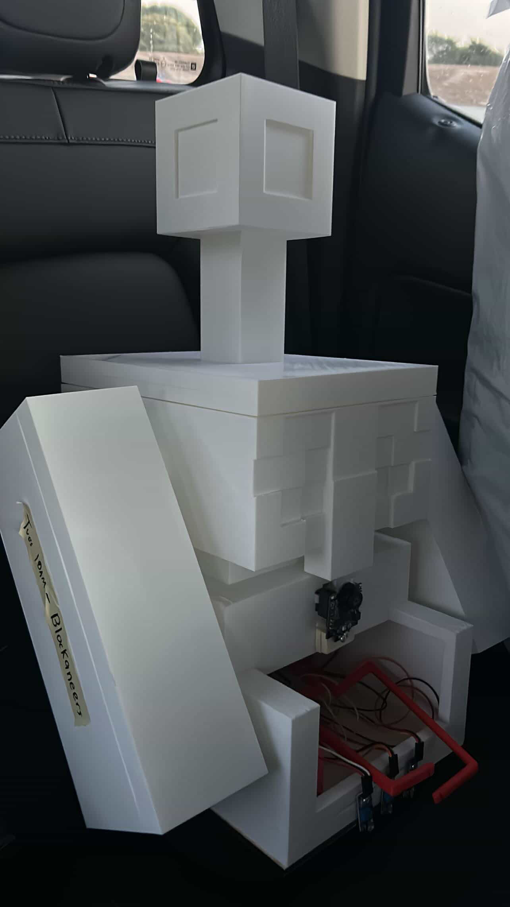

# Autonomous Line-Following Rover with Vision-Based Object Retrieval

A three-phase autonomous rover that tracks a black line using IR sensors, detcteds a target object via Pixy2 color-signature recognition, and retrieves it with a servo-driven claw. All of this is running on a single control loop

Built as part of ENGR 7B at UC Irvine.

---

## How It Works

The system operates in three sequential phases, all manages by a top-level state variable (linebar) that transitions the rover from line tracking to object retrieval.

### Phase 1 - Line Tracking

Three Digital IR Sensors are encoded as a 3-bit state (000-111). This produces eight possible cases each handled by a switch statement. The interesting cases:
- **Sustained corrections (001, 100):** Turn speed rampus up proportionally to how long the rover has been correcting in one directions. This prevents sluggish responses on sharp curves.  
- **Line lost (000):** The rover sweeps back and forth with increasing width, biased toward the side it last saw the line.
- **Outer sensors and center clear (101):** This means that the rover could be straddling the line either way. The rover then uses 'lastturn,' the direction of the last corrrection, to pick which way to go instead of guessing randomly.
- **All sensors triggered (111):** The rover has hit a completely solid bar across the track, meaning the end of the line. The motors now stop and Phase 2 begins.

### Phase 2 - Find and Center on the Can

The rover will now spin in place while simultaneously scanning for a block matching the trained color signature using a Pixy2 cam. Once the cam correctly recognizes the signature, the rover will run a proportional controller to center the can in the frame: 

- Error = how far the can is from the horizontal center of the camera (158px)
- Rotation speed scales with that error (gain of two, clamped between 60-120 PWM)
- "Centered" means the error is within ±10 pixels

### Phase 3 - Approach and Grab

The rover drives forward toward the can with proportional steering correction (left and right motors get different speeds based on how far off-center the can drifts during the approach). When the can's pixel width in the frame gets large enough (>800px), the rover knows the object is close. Two servos will then close the claw and lift

---

## Hardware

| Component | Detail |
|---|---|
| Microcontroller | Arduino Uno|
| Motors + Driver | Cytron motor drivers (PWM + DIR) |
| Line Sensors | 3x digital IR sensors (left, center, right) |
| Camera | Pixy2 (color-signature detection) |
| Actuators | 2x servo motors (claw + lift arm) |
| Chassis | 2WD robot platform |
| Power | Battery pack |

---

## Wiring

| Pin | Connection |
|---|---|
| 2 | Center IR Sensor |
| 3 | Left IR Sensor |
| 4 | Left motor DIR |
| 5 | Left motor PWM |
| 6 | Right motor PWM |
| 7 | Right motor DIR |
| 8 | Right IR Sensor |
| 9 | Lift servo |
| 10 | Claw servo |
| SPI | Pixy2 |

---

## Design Decisions

**why encode the sensros as a 3-bit number?**
Using a switch on all eight combinations force you to handle every case seperately. The 101 case (both outer sensors lit, center clear) is the kind of thing that's easy to skim over in a long chain of if/else statements, but is obvious when it has its own case block.

**why ramp turn speed over?**
I tried fixed-speed corrections first and the rover either couldn't keep up with the sharp curves or oscillated on gentle ones. Ramping up the speed based on how long it's been attempting to correct allows the rover to adapt without need a different constant for every curve radius. This would be inefficient in the code.

**why sweep both directions when the line is lost?**
If the rover overshoots a turn to the left but only spins right to recover, the rover will never find the line. Alternating directions with a widening arc covers both sides efficiently and quickly. Biasing the first sweep towards 'lastturn' means the rover will usually re-find the line on the first pass.

---

##Project Photos

---

## Dependencies 

- [Pixy2 Arduino Library] (https://pixycam.com/downloads-pixy2/)
- [CytronMotorDriver Library] (https://github.com/CytronTechnologies/CytronMotorDriver)
- Servo.h (included with Arduino IDE)
